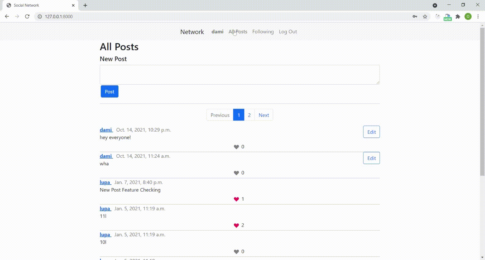

# Network
### Project 4 of CS50 Web
A Twitter-like social network that allows users to make posts, follow other users, and “like” posts.

### Functionality
Signed in users are able to write a new text-based post.  
“Following” link takes the user to a page where there are all posts made by users that the current user follows.  
There is also a pagination. On any page that displays posts, posts are only displayed 10 on a page.  
There is an opportunity for edeting existing post.  
Users are able to click a button on any post to toggle whether or not they “like” that post.  

### Demo 

